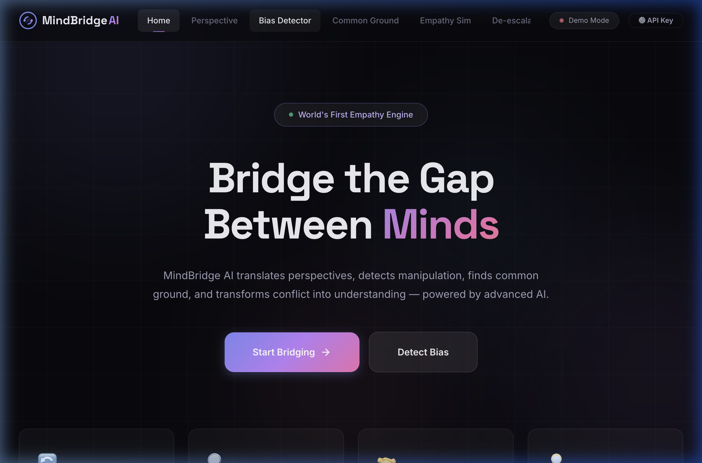
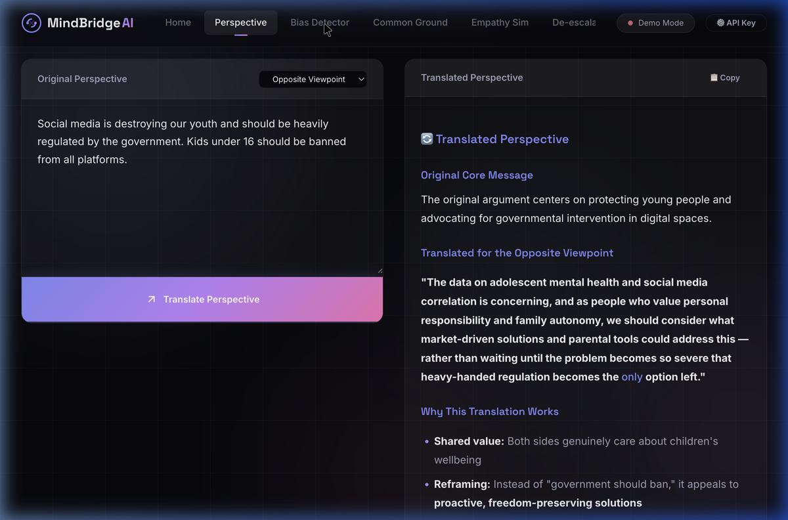
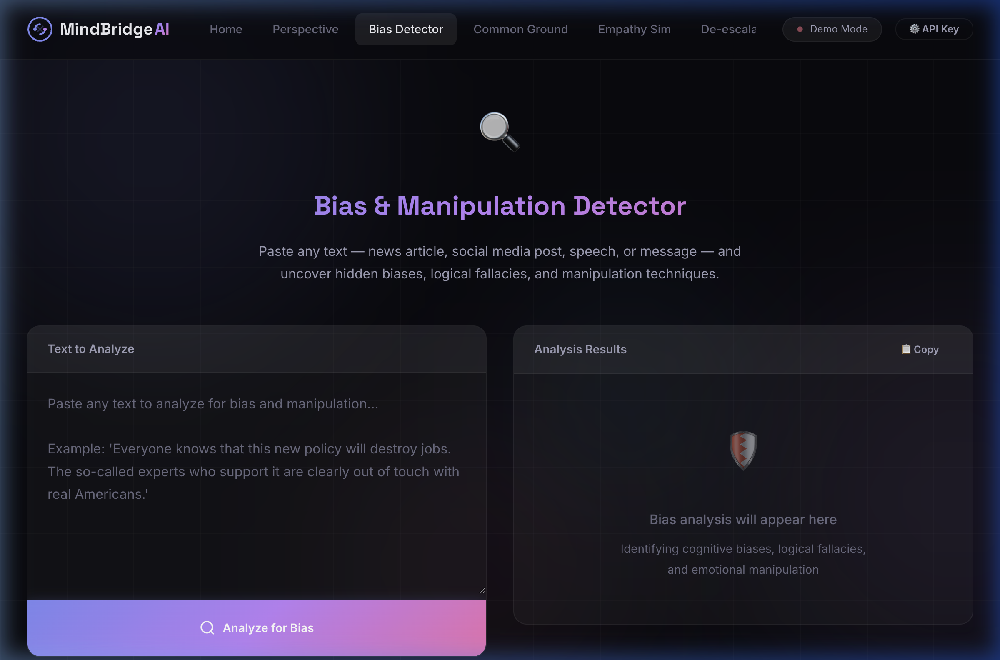
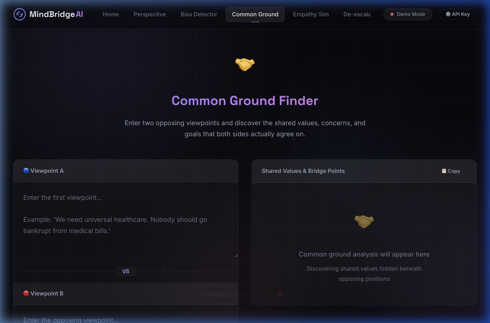
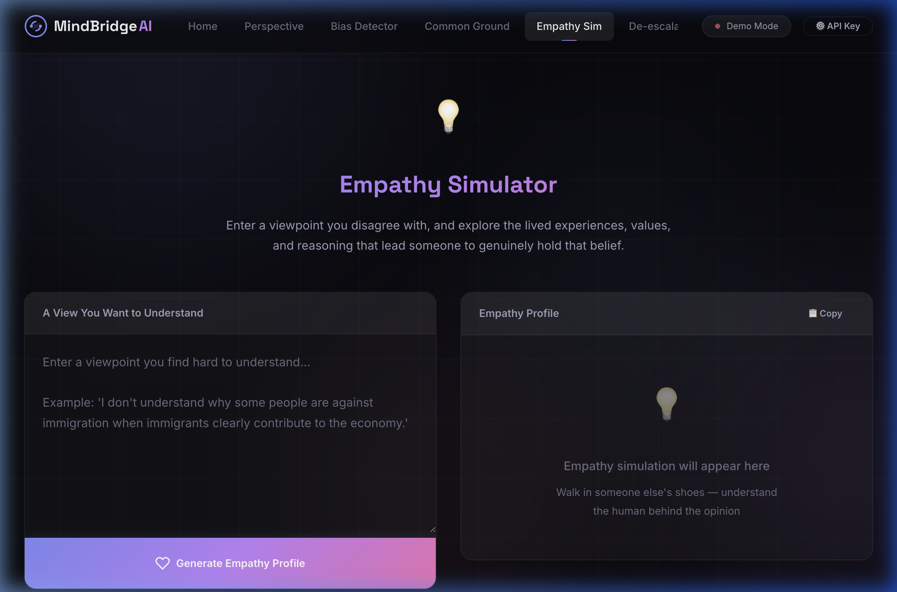
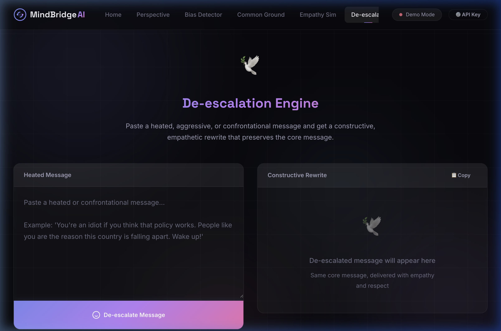

<div align="center">

# 🌉 MindBridge AI

**The world's first empathy engine.**

Translate perspectives · Detect bias · Find common ground · De-escalate conflict

[](https://mindbridge-ai-theta.vercel.app)
[](LICENSE)
[](https://ai.google.dev/)

<br>



</div>

---

## The Problem

We're more connected than ever — and more divided than ever.

- **77%** of Americans say the country is more divided than at any point in their lifetime
- Misinformation spreads **6x faster** than truth online
- Social media algorithms trap us in echo chambers
- Online debates devolve into personal attacks

Behind every one of these stats is the same root cause: **we've lost the ability to understand each other.**

Tools exist for translating *languages* — but nothing exists for translating *perspectives*. Until now.

---

## What MindBridge Does

MindBridge AI is a suite of 5 AI tools that help people communicate across ideological, cultural, and emotional divides.

### 🔄 Perspective Translator

Rewrites any argument so it resonates with someone who holds the opposite belief — same message, different framing.



---

### 🔍 Bias & Manipulation Detector

Scans any text for cognitive biases, logical fallacies, and emotional manipulation. Gives a manipulation score and suggests an honest rewrite.



---

### 🤝 Common Ground Finder

Two opposing viewpoints go in → shared values and bridge statements come out.



---

### 💡 Empathy Simulator

Enter a view you disagree with. Get a humanized profile of *why* a reasonable person holds that belief — their story, their fears, their values.



---

### 🕊️ De-escalation Engine

Paste a heated message → get a constructive rewrite that preserves the core point without the toxicity.



---

## How It Works

```
User Input → Prompt Engineering → Gemini 2.0 Flash → Markdown Rendering → Output
```

Each tool uses a specialized prompt that instructs the AI to:
- Stay neutral — never take sides
- Preserve the original message's core meaning
- Surface hidden values, fears, and shared ground
- Provide actionable bridge-building insights

The AI doesn't judge. It translates.

---

## Tech Stack

| | Technology |
|---|---|
| Frontend | HTML, CSS, JavaScript — zero frameworks, zero dependencies |
| AI | Google Gemini 2.0 Flash API |
| Design | Dark theme, glassmorphism, custom animations |
| Hosting | Vercel (global CDN) |
| Load time | < 1 second |

No React. No build step. No `node_modules`. Just clean code that loads instantly.

---

## Quick Start

**Option 1 — Use the live app:**

👉 **[mindbridge-ai-theta.vercel.app](https://mindbridge-ai-theta.vercel.app)**

**Option 2 — Run locally:**

```bash
git clone https://github.com/akashmdx2025-crypto/mindbridge-ai.git
cd mindbridge-ai
python3 -m http.server 8080
# Open http://localhost:8080
```

**To unlock full AI mode**, get a free API key from [Google AI Studio](https://aistudio.google.com/app/apikey) and enter it in the app.

---

## Who Is This For

| Audience | Use Case |
|---|---|
| Journalists | Check your own writing for unconscious bias |
| Teachers | Help students debate with empathy, not hostility |
| Mediators | Prepare bridge statements before difficult conversations |
| Anyone online | De-escalate a heated comment before hitting send |
| Curious humans | Genuinely understand why someone disagrees with you |

---

## Project Structure

```
├── index.html          # Single page app — all 5 tools
├── css/styles.css      # Design system (dark theme, animations)
├── js/app.js           # Logic, Gemini API, prompt engineering
└── docs/
    ├── README.md        # Extended documentation
    └── images/          # Screenshots
```

---

## Roadmap

- [ ] Browser extension — detect bias on any webpage
- [ ] Conversation mode — real-time mediation between two people
- [ ] History — save and revisit past analyses
- [ ] Share — generate links to share results
- [ ] Mobile app

---

## Contributing

Pull requests welcome. If you have ideas for new empathy tools or prompt improvements, open an issue.

---

## License

MIT

---

<div align="center">
<br>

*"You don't have to agree with someone to understand them."*

**Built for a more empathetic internet.**

</div>
